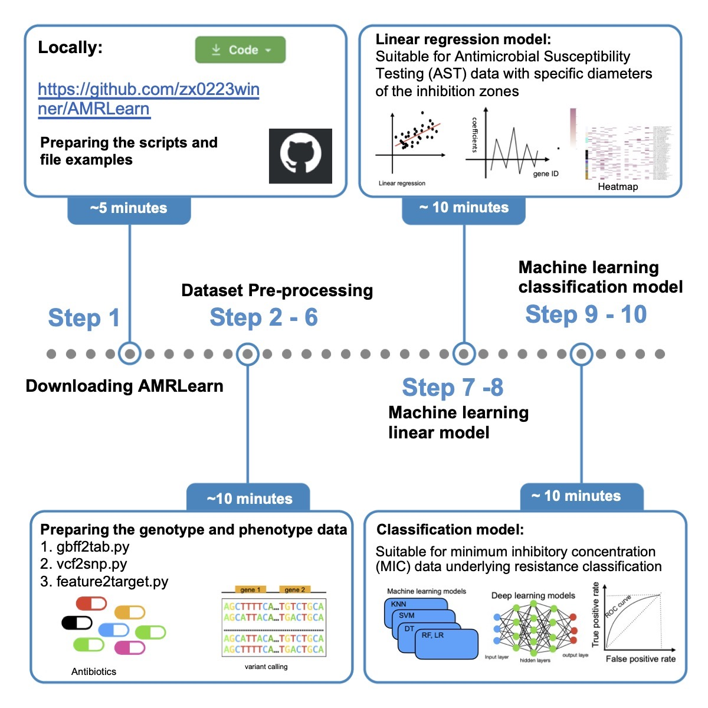

[](https://www.gnu.org/licenses/old-licenses/gpl-3.0)


# AMR_Learn

### 1. AMRLearn: A machine learning pipeline for characterization of antimicrobial resistance determinants in microbial genomic data


### 2. What's AMRLearn?

>Single-nucleotide polymorphisms (SNPs) are useful biomarkers for linking genotype to phenotype in a wide variety of biological contexts. In the realm of microbiology, this includes the study of host-pathogen interactions and antimicrobial resistance (AMR), which is one of the greatest threats facing humanity.

>However, traditional antimicrobial susceptibility testing (AST) and minimum inhibitory concentration (MIC) experiments are time-consuming and viable only for cultivable bacteria. Machine learning is a potentially powerful and rapid tool for predicting AMR from bacterial genome sequence data.

>Here we present AMRLearn, a machine learning pipeline to assist users in the prediction and visualization of AMR phenotypes associated with SNP genotypes. We describe the steps needed for input data preparation, prediction model selection and result visualization. AMRLearn is a useful tool for researchers wanting to extract information relevant to AMR from whole genome sequence data.

2.1 Computational Requirement

AMRLearn users can either follow the Star Protocol pipeline to install the required packages or use the Conda environment file to deploy the pipeline.

Create an environment from Conda YAML file
To install all required dependencies, we provided conda environment definition file (tested on the Ubuntu 20.04 LTS system) with all the dependencies. 
```bash
#You need to have the Conda to be installed on your system. For example, to install Anaconda distribution on Linux, users can follow the link to download the package.
#Run the following command to create an environemnt from Conda YAML file
source ~/.bashrc
conda env create --file AMRLearn_ML.yaml
conda env create --file AMRLearn_DL.yaml

#After downloading a long list of required dependencies. Activate the Conda environemnt and follow the pipeline to run respective packages/custom scripts.

# To activate the machine learning scripts environment, use  
$ conda activate AMRLearn_ML
# To deactivate an active environment, use
$ conda deactivate

# To activate the deep learning script environment, use  
$ conda activate AMRLearn_DL
# To deactivate an active environment, use
$ conda deactivate

```


2.2 generate the lcoation info from genbank file
```python3

# must clean the plasmid before running the genbank file.
# 1.gbff2tab.py
>Usage:python3 1.gbff2tab.py <gene_bank_file> <gene_output_file> 
#Example: python3 1.gbff2tab.py GCA_000005845.2.gbff gene_location_info.txt")
```

2.3 generate snps count table from Parsnp result
```python3
# 2.vcf2snp.py
>Usage:python3 2.vcf2snp.py <gene location info> <parsnp vcf file> <output file>
#Example: python3 2.vcf2snp.py gene_location_info.txt parsnp.ggr.vcf vcf_snp_count.txt
```

2.4 generate the table for the regression coffeficents
```python3
# 3.feature2target.py
>Usage:python3 3.feature2target.py vcf_snp_count.txt Antibiotics_test.txt feature2target.txt
```
2.5 the main machine learning scripts for linear models
```python3
# 4.AMR_Learn_linear.py
>Usage:python3 4.AMR_Learn_linear.py <output_file_name> <antibiotics name> <threshold for filtering absolute coefficient>
#Example: python3 AMRLearn.py feature2target.txt Spectinomycin 0.1
```

2.6 the main machine learning scripts for classification models
```python3
# 4.6.AMRLearn_classification_LR_KNN_DT_SVM_RF.py
>Usage:python3 6.AMRLearn_classification_LR_KNN_DT_SVM_RF.py <output_file_name> <antibiotics name>
#Example: python3 6.AMRLearn_classification_LR_KNN_DT_SVM_RF.py feature2target.txt Spectinomycin
```

### 3. Example of the files
--------------------------

#### 3.1  Example of the gbff2tab.py output file
The python script gbff2tab.py generates one output file: 4-column spreadsheet integrating with the information of locus tag, gene name, start and end site.

*Example of the 4-column gene location info file:* e.g., gene_location_info.txt
```
locus_tag	gene_name	start_site	end_site	gene_length
b0001	thrL	190	255	66
b0002	thrA	337	2799	2463
b0003	thrB	2801	3733	933
b0004	thrC	3734	5020	1287
b0005	yaaX	5234	5530	297
```
Column header explanation:
1. `locus_tag` gene id (e.g. b0001)
2. `gene_name` name info (e.g. thrL)
3. `start_site` location (e.g. 190)
4. `end_site` location (e.g., 255)

<a name="sec5"></a>


#### 3.2  Example of the Parsnp result file.
The python script vcf2snp.py generates one output file, the statistics count of snps based on gene location.

Parsnp was designed to align the core genome of hundreds to thousands of bacterial genomes. Input can be both draft assemblies and finished genomes, and output includes variant (SNP) calls, core genome phylogeny and multi-alignments.


*Example of the variants calling file(vcf) :* e.g.,parsnp.ggr.vcf
```
##INFO=<ID=CDS,Number=1,Type=String,Description="Coding sequence locus">
##INFO=<ID=SYN,Number=0,Type=Flag,Description="All alternative alleles are synonymous in coding sequence">
##INFO=<ID=AAR,Number=1,Type=String,Description="Reference amino acid in coding sequence">
##INFO=<ID=AAA,Number=.,Type=String,Description="Alternate amino acid in coding sequence, one per alternate allele">
##FILTER=<ID=IND,Description="Column contains indel">
##FILTER=<ID=N,Description="Column contains N">
##FILTER=<ID=LCB,Description="LCB smaller than 200bp">
##FILTER=<ID=CID,Description="SNP in aligned 100bp window with < 50% column % ID">
##FILTER=<ID=ALN,Description="SNP in aligned 100b window with > 20 indels">
#CHROM	POS	ID	REF	ALT	QUAL	FILTER	INFO	FORMAT	K12_GCA_000005845.2.gbff.fna	ERS357141.fa
U00096	9284	TTTAACGAGA.CTGTTTAAAC	C	A,G	40	LCB	NA	GT	1	1
```
Column header explanation:
1. `CHROM` identifiers:  (e.g. U00096)
2. `POS` location of the contig (e.g. 9284)
3. `ID` region (e.g., TTTAACGAGA.CTGTTTAAAC)
4. `REF` reference The protein functional type (e.g., C)
5. `ALT` altered (e.g. A,G)
6. `QUAL` quality (e.g. 40)
7. `FILTER` (e.g., LCB)
8. `INFO` InterPro Entry Identifier (e.g. NA)
9. `FORMAT` InterPro Entry Description (e.g. GT)
10. `K12_GCA_000005845.2.gbff.fna` SNPs# in contig with respect to location (e.g.,1)
<a name="sec5"></a>

#### 3.3  Example of the coef2gene.py output file
The python script coef2gene.py generates one output file: 3-column spreadsheet integrating with the information of locus tag, gene name, coef.

*Example of the 4-column gene location info file:* e.g., gene_location_info.txt
```
locus_tag	gene_name	coef
b0023	rpsT	0.1496219910027701
b0050	apaG	-0.32696651355652995
b0051	rsmA	-0.5762155558287797
b4810	ftsO	0.1101401332761501
b0087	mraY	0.1288226342149588

```
Column header explanation:
1. `locus_tag` gene id (e.g. b0023)
2. `gene_name` name info (e.g. rpsT)
3. `coef` location (e.g. 0.1496219910027701)
<a name="sec5"></a>

### 4. AMR_Learn dependencies

user will need to install respective packages
> pip3 install -U scikit-learn scipy matplotlib pandas

```python3


#import dataframe, array, plot required packages 
import pandas as pd
import numpy as np
import matplotlib.pyplot as plt

#import regression models
from sklearn.linear_model import LinearRegression
from sklearn.linear_model import Ridge
from sklearn.linear_model import Lasso
from sklearn.svm import LinearSVC

#import classification models
from sklearn.linear_model import LogisticRegression
from sklearn.tree import DecisionTreeClassifier
from sklearn.ensemble import RandomForestClassifier
from sklearn.neighbors import KNeighborsClassifier 
from sklearn.svm import SVC


# pip3 install -U scikit-learn scipy matplotlib
import os
import pandas as pd
import numpy as np
import matplotlib.pyplot as plt
from sklearn.linear_model import LinearRegression
from sklearn.linear_model import LogisticRegression
from sklearn.linear_model import Ridge
from sklearn.linear_model import Lasso
from sklearn.model_selection import train_test_split
from sklearn.model_selection import cross_val_score
from sklearn.metrics import accuracy_score
from sklearn.model_selection import GridSearchCV
from sklearn.tree import DecisionTreeClassifier
from sklearn.ensemble import RandomForestClassifier
from sklearn.neighbors import KNeighborsClassifier 
from sklearn.metrics import classification_report
from sklearn.metrics import confusion_matrix
from sklearn.metrics import roc_curve
from sklearn.preprocessing import scale
from sklearn.svm import SVC
from sklearn.svm import LinearSVC
from sklearn.metrics import roc_curve
from sklearn.metrics import roc_auc_score
from sklearn import metrics

```

### 5.Limitation
AMRLearn users can experience a steep learning curve if they are not familiar with the basic command lines and dash shell in a Linux/Unix environment. At present, a “one-click” solution to the bioinformatic protocols employed by AMRLearn does not exist; it is desirable to retain flexibility in the usage of our scripts for different types of input data processing. That said, AMRLearn is comparatively easier to use and install with one of the most popular and well-maintained programming languages – Python as well as the Scikit learn and TensorFlow libraries. At present there are few tools that can characterize the relationship between AMR and SNPs in genomic data via classification and linear machine learning models. AMRLearn thus fills a need for the bioinformatics and genomics community.

### 6. Reference
1.Zhang, Xi, Yining Hu, Zhenyu Cheng, and John M. Archibald. "AMRLearn: Protocol for a machine learning pipeline for characterization of antimicrobial resistance determinants in microbial genomic data." STAR protocols 6, no. 2 (2025): 103733.https://doi.org/10.1016/j.xpro.2025.103733
